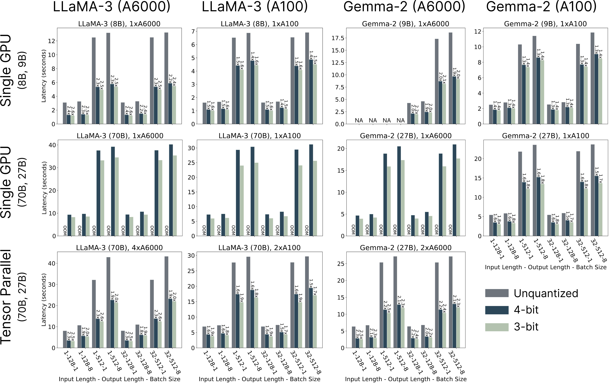
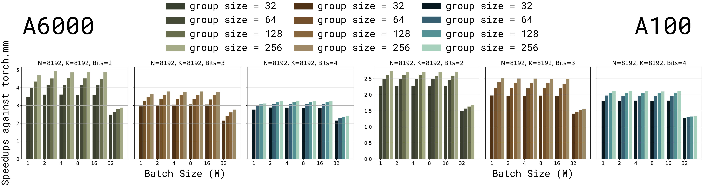

<p align="center">
    
</p>

<p align="center">
  <em><strong>FLUTE</strong>: Flexible Lookup Table Engine for LUT-quantized LLMs <br></em>
</p>

<div align="center">

  
  <a href="https://pypi.org/project/flute-kernel/"></a>
  <a href="https://arxiv.org/abs/2407.10960"></a>
</div>


# Benchmarks

<p align="center">
  
    
</p>

<p align="center">
   
</p>


# Getting Started

Install FLUTE with pip or [from source](#build-from-source):
```bash
# For CUDA 12.1
pip install flute-kernel
# For CUDA 11.8 (not working as of now!)
pip install flute-kernel -i https://flute-ai.github.io/whl/cu118
```

## FLUTE + vLLM
FLUTE-quantized models ([Model Zoo](#models)) can be directly served using exisiting frameworks such as vLLM.

```diff
- python -m vllm.entrypoints.openai.api_server \
+ python -m flute.integrations.vllm vllm.entrypoints.openai.api_server \
    --model [MODEL] \
    --tokenizer [TOKENIZER] \
    --tensor-parallel-size [TP_SIZE] \
+   --quantization flute
```

For example, the following commmand runs the FLUTE-quantized LLaMA-3 (8B) on a single GPU.

```bash
python -m flute.integrations.vllm vllm.entrypoints.openai.api_server \
    --model radi-cho/Meta-Llama-3-8B-FLUTE \
    --quantization flute
```

We can then query the vLLM server as usual.
```bash
curl http://localhost:8000/v1/completions \
    -H "Content-Type: application/json" \
    -d '{
        "model": "radi-cho/Meta-Llama-3-8B-FLUTE",
        "prompt": "San Francisco is a",
        "max_tokens": 7,
        "temperature": 0
    }'
```

## FLUTE + HuggingFace
FLUTE also runs out of the box with HuggingFace and its `accelerate` extension. This integration is mostly experimental and not optimized. Users sensitive to performance considerations should use the `vLLM` integration instead.

The following example performs simple quantization to the dense model. After this, the model can be used as normal. (Support for loading pre-quantized model is coming soon!)

```python
import flute.integrations.base
flute.integrations.base.prepare_model_flute(
    module=model.model.layers,  # for LLaMA-3 and Gemma-2
    num_bits=num_bits,
    group_size=group_size,
    fake=False,
    handle_hooks=True)  # for `accelerate` hooks
```


# Kernel Compatibility

| Description      | Supported (via pip) | Supported (build from source) |
| ----------- | ----------- | ----------- |
| Input dtypes   | `torch.float16` `torch.bfloat16` |  |
| Bits | `4bit` `3bit` | `2bit` |
| Group Sizes | `32` `64` `128` `256` | ❓ |
| GPUs | `A100` `A6000` | `RTX 4090` `H100` (unoptimized) |

> [!WARNING]
> In the current release, we tuned the kernel templates for `torch.float16` only, and we noticed `torch.bfloat16` is slower than `torch.float16`. This likely because of lack of tuning, and that Ampere GPUs lack a hardware acceleration for `bfloat16` [vectorized atomic-add](https://github.com/HanGuo97/flute/blob/main/flute/csrc/cutlass_extensions_bf16.h#L27).

> [!WARNING]
> We noticed several numerically unstable situations using `bits=4, group-size=256, GPU=A100`. This is relatively rare (8 of 9360 test cases failed), but we suggest avoiding this particular use case for now. 

# Models

> [!NOTE]
> As of the current release, the kernel is shape-specialized due to legacy reasons (i.e., we tune tile sizes etc for each matrix shape). Please see the below chart for the supported use cases, as different platform and tensor parallel size changes the matrix shapes. We plan to add supports for a broad range of shapes in the near future. In the meantime, please let us know if you have any specific models in mind and we are happy to add support for them.

| Model      | Single GPU / Pipeline Parallel | Tensor Parallel | Link |
| ----------- | ----------- | ----------- | ----------- | 
| LLaMA-3 (8B) | ✅ | | [NF (Learned)](https://huggingface.co/radi-cho/Meta-Llama-3-8B-FLUTE) |
| LLaMA-3 (70B) | ✅ | 2 or 4 GPUs  | [NF (Learned)](https://huggingface.co/radi-cho/Meta-Llama-3-70B-FLUTE) |
| Gemma-2 (9B) | ✅ |  | TBD |
| Gemma-2 (27B) | ✅ | 2 or 4 GPUs  | TBD |


## Quantizing Your Own Models

We provide two APIs to quantize a custom models. The easist way is to use the command line interface.

### Simple Normal Float Quantization

```bash
python -m flute.integrations.base \
    --pretrained_model_name_or_path meta-llama/Meta-Llama-3-70B-Instruct \
    --save_directory Meta-Llama-3-70B-Instruct-NF4 \
    --num_bits 4 \
    --group_size 128
```

The CLI essentially wraps around the following Python API,

```python
from transformers import (
    LlamaForCausalLM,
    Gemma2ForCausalLM,
    AutoModelForCausalLM)
import flute.integrations.base

model = AutoModelForCausalLM.from_pretrained(
    pretrained_model_name_or_path,
    device_map="cpu",
    torch_dtype="auto")

if isinstance(model, (LlamaForCausalLM, Gemma2ForCausalLM)):
    flute.integrations.base.prepare_model_flute(
        module=model.model.layers,
        num_bits=num_bits,
        group_size=group_size,
        fake=False)
else:
    # more models to come
    raise NotImplementedError
```

### Learned Normal Float Quantization

Soon!

# Build From Source

1. Clone the CUTLASS library.

```bash
# Unfortunately, the path is hard-coded as of now. If you install CUTLASS
# in a different directory, please make sure the corresponding path in
# `setup.py` is updated.
cd /workspace

git clone https://github.com/NVIDIA/cutlass.git
cd cutlass
git checkout v3.4.1
```

2. Build.

```bash
git clone https://github.com/HanGuo97/flute
cd flute
pip install -e .
```

**Note:** the build process requires having the local CUDA version (`nvcc --version`) match PyTorch's CUDA. In situations in which the build process throws an error related to CUDA version mismatch, try adding `--no-build-isolation`.


# Citation
To cite this repository:

```bibtex
@article{flute2024,
  title={Fast Matrix Multiplications for Lookup Table-Quantized LLMs},
  author={Guo, Han and Brandon, William and Cholakov, Radostin and Ragan-Kelley, Jonathan and Xing, Eric P and Kim, Yoon},
  journal={arXiv preprint arXiv:2407.10960},
  year={2024}
}
```
