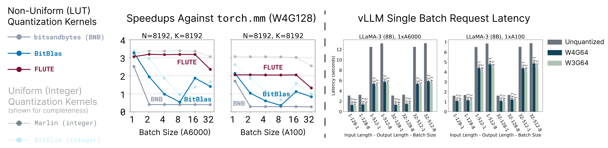

<p align="center">
    
</p>

<p align="center">
  <em><strong>FLUTE</strong>: Flexible Lookup Table Engine for LUT-quantized LLMs <br></em>
</p>

<div align="center">

  
  <a href="https://pypi.org/project/flute-kernel/"></a>
  <a href="https://arxiv.org/abs/2407.10960"></a>
</div>

<div align="center">

[[Backgorund](#background)] [[Benchmarks](#benchmarks)] [[Getting Started](#getting-started)] [[Compatibility](#support-and-compatibility)] [[Model Zoo](#model-zoo)]

</div>

# Update
- **July 27, 2024.** Added support for LLaMA-3.1 (405B) and tuned BF16 performance. FP16 is still the recommended data type, especially for 3-bit settings.

# Installation

Install FLUTE with pip or [from source](#build-from-source):
```bash
# For CUDA 12.1
pip install flute-kernel
# For CUDA 11.8
pip install flute-kernel -i https://flute-ai.github.io/whl/cu118
```
Head over to [Getting Started](#getting-started) and try it out!

# Background
**Uniform quantization** converts full precision weights to lower-precision intervals of equal size. **Lookup table (LUT) quantization** is a flexible variant of non-uniform quantization which can map intervals to arbitrary values via a lookup table. 

<table align="center">
<tr>
<th>Uniform (Integer) Quantization</th>
<th>Lookup Table Quantization</th>
</tr>
<tr>
<td align="center">

$$\widehat{\mathbf{W}} = \mathtt{float}(\mathbf{Q}) \cdot \mathbf{s}$$

</td>
<td align="center">

$$\widehat{\mathbf{W}} = \mathtt{tableLookup}(\mathbf{Q}, \mathtt{table}) \cdot \mathbf{s}$$

</td>
</tr>
</table>

where $\mathbf{Q}$ denote the quantized weight, $\mathbf{s}$ the (group-wise) scales, and $\widehat{\mathbf{W}}$ the de-quantized weight. Here are some examples of the lookup table suppored in FLUTE.

<table align="center">
<tr>
<th>Examples</th>
<th>Notes</th>
</tr>
<tr>
<td align="left">

`int4`, `int3`, `int2`

</td>
<td align="left">

recovers uniform/integer quantization

</td>
</tr>
<tr>
<td align="left">

`fp4`, `fp3`, `fp2`

</td>
<td align="left">
</td>
</tr>
<tr>
<td align="left">

`nf4`, `nf3`, `nf2`

</td>
<td align="left">

generalizes the `nf4` data-format introduced in QLoRA

</td>
</tr>
</td>
</tr>
<tr>
<td align="left">

any arbitrary table

</td>
<td align="left">

you could even learn it!

</td>
</tr>
</table>

### New Models Powered by FLUTE
The flexibility of the kernel could lead to new quantization algorithms. As a proof of concept, we are releasing a few [models](#models) quantized using **Learned Normal Float (NFL)** --- a simple extension to the `nf4` data format introduced in QLoRA. NFL initialized the lookup table and the scales with those from NF quantization. Then, it uses calibration data to learn the scales via straight through estimation for for the gradient with respect to the scales.


# Benchmarks

For additional benchmarks, detailed breakdowns, and corresponding instruction-tuned models, please refer to the paper and the [model zoo](#model-zoo).

<p align="center">
  
</p>


### LLaMA-3
|               | Wiki PPL | C4 PPL    | LLM Eval Avg.  |               | Wiki PPL | C4 PPL   | LLM Eval Avg.  |
| -----------   | ---- | ----- | -----          | -----------   | ---- | ---- | -----          |
| LLaMA-3 (8B)  | 6.1  | 9.2   | 68.6           | LLaMA-3 (70B) | 2.9  | 6.9  | 75.3           |
| + NFL W4G64       | 6.11 | 9.38  | 68.41          | + NFL W4G64       | 3.03 | 7.03 | 74.39          |
| + NFL W3G64       | 7.13 | 11.06 | 65.28          | + NFL W3G64       | 4.15 | 8.10 | 72.45          |


### Gemma-2
|               | Wiki PPL | C4 PPL    | LLM Eval Avg.  |               | Wiki PPL | C4 PPL   | LLM Eval Avg.  |
| -----------   | ---- | ----- | -----          | -----------   | ---- | ---- | -----          |
| Gemma-2 (9B)  | 6.88 | 10.12 | 73.12          | Gemma-2 (27B) | 5.70 | 8.98 | 75.71          |
| + NFL W4G64       | 6.49 | 10.35 | 72.50          | + NFL W4G64       | 5.69 | 9.31 | 74.11          |


# Getting Started

## FLUTE + vLLM
FLUTE-quantized models ([Model Zoo](#models)) can be directly served using exisiting frameworks such as vLLM.

```diff
- python -m vllm.entrypoints.openai.api_server \
+ python -m flute.integrations.vllm vllm.entrypoints.openai.api_server \
    --model [MODEL] \
    --revision [REVISION] \
    --tensor-parallel-size [TP_SIZE] \
+   --quantization flute
```

For example, the following commmand runs the FLUTE-quantized LLaMA-3 (8B) on a single GPU.

```bash
python -m flute.integrations.vllm vllm.entrypoints.openai.api_server \
    --model radi-cho/Meta-Llama-3-8B-FLUTE \
    --quantization flute
```

We can then query the vLLM server as usual.
```bash
curl http://localhost:8000/v1/completions \
    -H "Content-Type: application/json" \
    -d '{
        "model": "radi-cho/Meta-Llama-3-8B-FLUTE",
        "prompt": "San Francisco is a",
        "max_tokens": 7,
        "temperature": 0
    }'
```

## FLUTE + HuggingFace
FLUTE also runs out of the box with HuggingFace and its `accelerate` extension. This integration is mostly experimental and not optimized. Users sensitive to performance considerations should use the `vLLM` integration instead.

The following example performs simple quantization to the dense model. After this, the model can be used as normal. (Support for loading pre-quantized model is coming soon!)

```python
import flute.integrations.base
flute.integrations.base.prepare_model_flute(
    module=model.model.layers,  # for LLaMA-3 and Gemma-2
    num_bits=num_bits,
    group_size=group_size,
    fake=False,
    handle_hooks=True)  # for `accelerate` hooks
```


# Support and Compatibility

## Kernel

| Description      | Supported (via pip) | Supported (build from source) |
| ----------- | ----------- | ----------- |
| Input dtypes   | `torch.float16` `torch.bfloat16` |  |
| Bits | `4bit` `3bit` | `2bit` |
| Group Sizes | `32` `64` `128` `256` | ❓ |
| GPUs | `A100` `A6000` | `RTX 4090` `H100` (unoptimized) |

> [!WARNING]
> In the current release, we noticed `torch.bfloat16` is slower than `torch.float16`. This likely because of lack of tuning, and that Ampere GPUs lack a hardware acceleration for `bfloat16` [vectorized atomic-add](https://github.com/HanGuo97/flute/blob/main/flute/csrc/cutlass_extensions_bf16.h#L27).

> [!WARNING]
> We noticed several numerically unstable situations using `bits=4, group-size=256, GPU=A100`. This is relatively rare (8 of 9360 test cases failed), but we suggest avoiding this particular use case for now. 

## Models

> [!NOTE]
> As of the current release, the kernel is shape-specialized due to legacy reasons (i.e., we tune tile sizes etc for each matrix shape). Please see the below chart for the supported use cases, as different platform and tensor parallel size changes the matrix shapes. We plan to add supports for a broad range of shapes in the near future. In the meantime, please let us know if you have any specific models in mind and we are happy to add support for them.

| Model      | Single GPU / Pipeline Parallel | Tensor Parallel |
| ----------- | ----------- | ----------- |
| LLaMA-3 (8B) | ✅ | |
| LLaMA-3 (70B) | ✅ | 2 or 4 GPUs  |
| Gemma-2 (9B) | ✅ |  |
| Gemma-2 (27B) | ✅ | 2 or 4 GPUs  |


# Model Zoo

> [!NOTE]
> The models we release here are trained on more data and hence different from those in the paper.

> [!TIP]
> The HuggingFace Hub links are for `NFL W4G64` quantization by default. To use the `NFL W3G64` quantization, add `--revision nfl_w3g64`.

### [LLaMA-3 (8B)](https://huggingface.co/radi-cho/Meta-Llama-3-8B-FLUTE)

|             | Wiki | C4    | PIQA  | ARC-E | ARC-C | HellaSwag | Wino  | Avg.  |
| ----------- | ---- | ----- | ----- | ----- | ----- | --------- | ----- | ----- |
| Unquantized | 6.1  | 9.2   | 79.9  | 80.1  | 50.4  | 60.2      | 72.8  | 68.6  |
| NFL W4G64       | 6.11 | 9.38  | 79.33 | 79.79 | 49.74 | 59.22     | 73.95 | 68.41 |
| NFL W3G64       | 7.13 | 11.06 | 78.78 | 76.22 | 44.37 | 56.69     | 70.32 | 65.28 |


### [LLaMA-3 (70B)](https://huggingface.co/radi-cho/Meta-Llama-3-70B-FLUTE)

|             | Wiki | C4   | PIQA  | ARC-E | ARC-C | HellaSwag | Wino  | Avg.  |
| ----------- | ---- | ---- | ----- | ----- | ----- | --------- | ----- | ----- |
| Unquantized | 2.9  | 6.9  | 82.4  | 86.9  | 60.3  | 66.4      | 80.6  | 75.3  |
| NFL W4G64       | 3.03 | 7.03 | 82.15 | 85.98 | 57.85 | 66.17     | 79.79 | 74.39 |
| NFL W3G64       | 4.15 | 8.10 | 80.74 | 83.71 | 55.29 | 64.05     | 78.45 | 72.45 |


### [LLaMA-3 Instruct (8B)](https://huggingface.co/radi-cho/Meta-Llama-3-8B-Instruct-FLUTE)

|             | Wiki | C4    |
| ----------- | ---- | ----- |
| NFL W4G64       | 6.78 | 10.61 |
| NFL W3G64       | 7.75 | 12.28 |


### [LLaMA-3 Instruct (70B)](https://huggingface.co/radi-cho/Meta-Llama-3-70B-Instruct-FLUTE)

|       | Wiki | C4    |
| ----- | ---- | ----- |
| NFL W4G64 | 3.67 | 7.95  |
| NFL W3G64 | 4.90 | 10.86 |


### [Gemma-2 (9B)](https://huggingface.co/radi-cho/gemma-2-9b-FLUTE)

|             | Wiki | C4    | PIQA  | ARC-E | ARC-C | HellaSwag | Wino  | Avg.  |
| ----------- | ---- | ----- | ----- | ----- | ----- | --------- | ----- | ----- |
| Unquantized | 6.88 | 10.12 | 81.39 | 87.37 | 61.35 | 61.23     | 74.27 | 73.12 |
| NFL W4G64       | 6.49 | 10.35 | 81.28 | 86.24 | 59.30 | 60.40     | 75.30 | 72.50 |
| NFL W3G64       | 7.06 | 11.14 | 80.52 | 83.16 | 55.46 | 58.28     | 72.69 | 70.02 |


### [Gemma-2 (27B)](https://huggingface.co/radi-cho/gemma-2-27b-FLUTE)

|             | Wiki | C4   | PIQA  | ARC-E | ARC-C | HellaSwag | Wino  | Avg.  |
| ----------- | ---- | ---- | ----- | ----- | ----- | --------- | ----- | ----- |
| Unquantized | 5.70 | 8.98 | 83.24 | 87.84 | 62.88 | 65.35     | 79.24 | 75.71 |
| NFL W4G64       | 5.69 | 9.31 | 82.53 | 86.45 | 59.22 | 64.13     | 78.21 | 74.11 |


### [Gemma-2 Instruct (9B)](https://huggingface.co/radi-cho/gemma-2-9b-it-FLUTE)

|             | Wiki | C4    |
| ----------- | ---- | ----- |
| NFL W4G64       | 6.88 | 11.02 |
| NFL W3G64       | 7.35 | 11.72 |

### [Gemma-2 Instruct (27B)](https://huggingface.co/radi-cho/gemma-2-27b-it-FLUTE)

|       | Wiki | C4    |
| ----- | ---- | ----- |
| NFL W4G64 | 5.91 | 9.71  |


## Quantizing Your Own Models

We provide two APIs to quantize a custom models. The easist way is to use the command line interface.

### Simple Normal Float Quantization

```bash
python -m flute.integrations.base \
    --pretrained_model_name_or_path meta-llama/Meta-Llama-3-70B-Instruct \
    --save_directory Meta-Llama-3-70B-Instruct-NF4 \
    --num_bits 4 \
    --group_size 128
```

The CLI essentially wraps around the following Python API,

```python
from transformers import (
    LlamaForCausalLM,
    Gemma2ForCausalLM,
    AutoModelForCausalLM)
import flute.integrations.base

model = AutoModelForCausalLM.from_pretrained(
    pretrained_model_name_or_path,
    device_map="cpu",
    torch_dtype="auto")

if isinstance(model, (LlamaForCausalLM, Gemma2ForCausalLM)):
    flute.integrations.base.prepare_model_flute(
        module=model.model.layers,
        num_bits=num_bits,
        group_size=group_size,
        fake=False)
else:
    # more models to come
    raise NotImplementedError
```

### Learned Normal Float Quantization

Soon!

# Build From Source

1. Clone the CUTLASS library.

```bash
# Unfortunately, the path is hard-coded as of now. If you install CUTLASS
# in a different directory, please make sure the corresponding path in
# `setup.py` is updated.
cd /workspace

git clone https://github.com/NVIDIA/cutlass.git
cd cutlass
git checkout v3.4.1
```

2. Build.

```bash
git clone https://github.com/HanGuo97/flute
cd flute
pip install -e .
```

**Note:** the build process requires having the local CUDA version (`nvcc --version`) match PyTorch's CUDA. In situations in which the build process throws an error related to CUDA version mismatch, try adding `--no-build-isolation`.


# Acknowledgement and Citation

Special thanks to Dmytro Ivchenko, Yijie Bei, and the Fireworks AI team for helpful discussion. If you find any of the models or code in this repo useful, please feel free to cite:

```bibtex
@article{flute2024,
  title={Fast Matrix Multiplications for Lookup Table-Quantized LLMs},
  author={Guo, Han and Brandon, William and Cholakov, Radostin and Ragan-Kelley, Jonathan and Xing, Eric P and Kim, Yoon},
  journal={arXiv preprint arXiv:2407.10960},
  year={2024}
}
```
